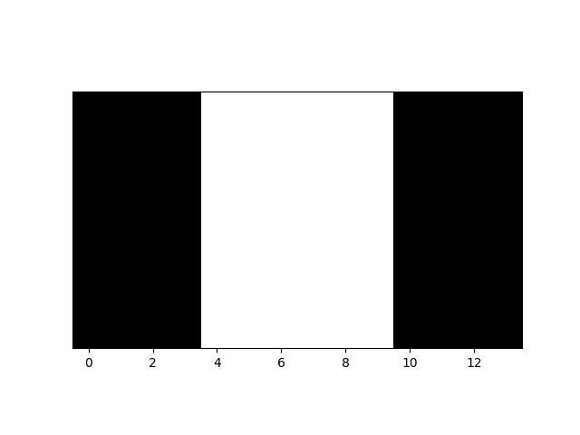

[](
  https://circleci.com/gh/dwave-examples/paint-shop-optimization)

# Multi-Car Paint Shop Optimization

This is an example for generalization of binary paint shop optimization outlined 
by Volkswagen team in the paper "Yarkoni et. al. Multi-car paint shop 
optimization with quantum annealing". 

In car manufacturing one step of production is painting
the car body before assembly. A queue of car bodies that enter the paint shop, undergo
the painting procedure, and exit the paint shop. For all practical purposes, 
the sequence of cars entering the paint shop is assumed to be fixed. 
However, the colors assigned to the cars within a given sequence can be optimized.

The goal of the optimization is to minimize the number of color switches between 
cars in a paint shop queue. This problem is known to be NP-hard. We demonstrate
how to formulate this problem using `dimod.ConstrainedQuadraticModel`.

The problem instances used in this example are generated randomly. You can also
follow the example in `data/exp.yaml` to generate your instances. The instance in 
the mentioned file is taken from the paper by Yarkoni et. al.


The formulation of this optimization problem can be summarized as:
1) Minimize the number of color changes
2) Ensure that the correct number of cars are painted white/black


## Usage

To run a small demo, run the command:

```bash
python carpaintshop.py --filename data/exp.yml
```

data/exp.yml is a small data set that includes a sequence of cars 
under `sequence` and the number of cars to be painted black 
for each car ensemble under `counts`. 

To run the demo on a random instance, run the command:

```bash
python carpaintshop.py --num-cars 10
```

You can configure a seed, and a few other parameters to generate your desired
random problem. For the full list of parameters please see the docstring of the
`main` function in `carpaintshop.py`. 


## Output
The script `carpaintshop.py` creates and solves an optimization problem given input 
or given parameters of a random problem. After creating the optimization problem, it 
sends it to the CQM solver (`LeapHybridCQMSampler`). The output of the sampler is 
processed and the three best feasible solutions are printed. The objective function 
and the number of color switches are printed. Note that if the `mode=1` is selected, 
the objective and number of switches are equal. After the script is complete, you'll 
also find an image for each of the solutions. The image contains a strip of white or 
black for each color stacked together horizontally.

The images will be saved in the `images` folder.



The image above shows that the first four cars (indexed at 0 to 3) and the last 
four cars (indexed at 10 to 13) are painted black and the rest are painted white. 
Therefore, there are two color switches. That is one of the optimal solutions. The 
image below shows another optimal solution with two color switches.


## Formulation
### Objective
Suppose that we have `N` cars in a sequence. Each car can be painted with black or 
white. The goal of the optimization is to reduce the number of times the color 
switches since there is a cost and waste associated with switching paint.

In the original paper the authors work with spin variables that take the values 
{white=-1,black=1}, we instead work with binary variables with values in {white=0, black=1}. A spin 
variable `s` can be converted to a binary variable `x` as follows.


We can optimize the number of color switches by counting the number of times 
the binary value of adjacent cars changes.


Alternatively, we can reduce the number of color changes by minimizing a function 
that rewards (assigns negative value) assigning the same color to adjacent cars. 
This function can easily be expressed in terms of spin variables. When two cars 
in the sequence have the same color, the product of their value is positive and 
if the colors are different, the product is negative.


Equivalently, the equation above can be written with binary variables as:


You can show that the number of color switches is related to the objective 
function that maximized the number of similar adjacent colors as shown below


### Constraints
The sequence of `N` cars has `M` car ensembles (`M < N`). For each car ensembles we 
want to make sure that the correct number of them are painted black (and the remaining 
ones are painted white). 

The equation below represents the constraint that the sum over the binary 
variables representing cars of ensemble `j` should equal the number of cars 
in ensemble `j` that should be painted black (`N_j`).


## Code

When using the `dimod.ConstraintQuadraticModel`, it's easy to encode the 
objective and constraints. In particular, using `dimod.Binary` we can create 
each objective using symbolic operations.

Let's define `x` as the list of binary variables `x[0] = dimod.Binary(0)` to 
`x[9] = dimod.Binary(9)` for 10 cars in a sequence. We can compute the number 
of color changes by looking at the difference of adjacent cars. For example, 
`x1-x0` gives us the difference of `+1` or `-1` or `0`. Since only the value 
of `0` is desired, we can optimize the square of the difference. The objective 
function for the first pair of adjacent variables is

```python
import dimod
x = list(dimod.Binaries(range(10)))
objective = 0
for i in range(9):
    objective += (x[i + 1] - x[i]) ** 2

cqm = dimod.ConstrainedQuadraticModel()
cqm.set_objective(objective)
```

Note that the operators `-`, and `**` can be used with variables `x`. We can 
then add this objective to a `dimod.ConstraintQuadraticModel` object.


## References

[1] Yarkoni et. al. Multi-car paint shop optimization with quantum annealing, 
[arxiv](https://arxiv.org/pdf/2109.07876.pdf)

## License

Released under the Apache License 2.0. See [LICENSE](LICENSE) file.
